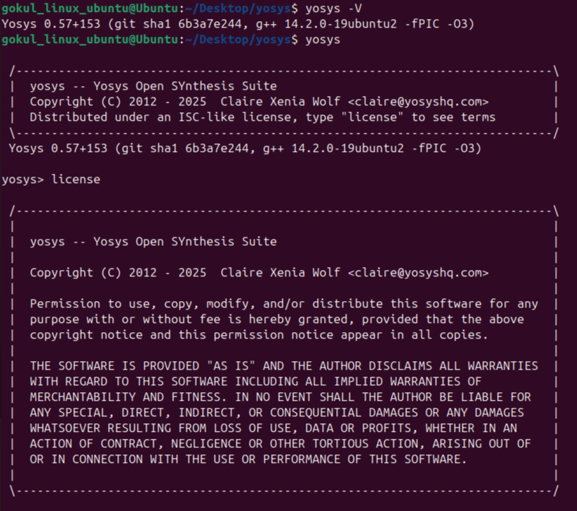

# System & Tool Check

## 💻 System Check
| Component | Specification   |
|-----------|-----------------|
| RAM       | 6 GB            |
| HDD       | 50 GB           |
| OS        | Ubuntu 20.04+   |
| CPU       | 4 vCPU          |

## 🛠️ Tool Check

### ➤ Yosys
```bash
$ sudo apt-get update
$ git clone https://github.com/YosysHQ/yosys.git
$ cd yosys
$ sudo apt install make   # (If make is not installed, please install it)
$ sudo apt-get install build-essential clang bison flex \
  libreadline-dev gawk tcl-dev libffi-dev git \
  graphviz xdot pkg-config python3 libboost-system-dev \
  libboost-python-dev libboost-filesystem-dev zlib1g-dev
$ make config-gcc
$ make
$ sudo make install
```



### ➤ iverilog
```bash
sudo apt-get update
sudo apt-get install iverilog
```


### ➤ gtkwave
```bash
sudo apt-get update
sudo apt install gtkwave 
```

